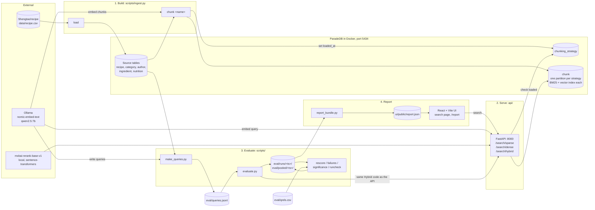
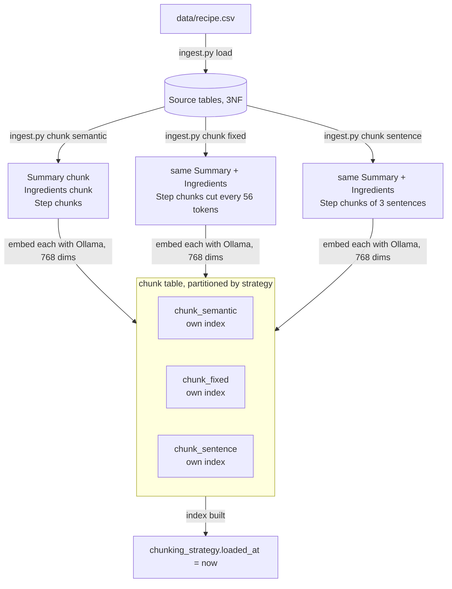
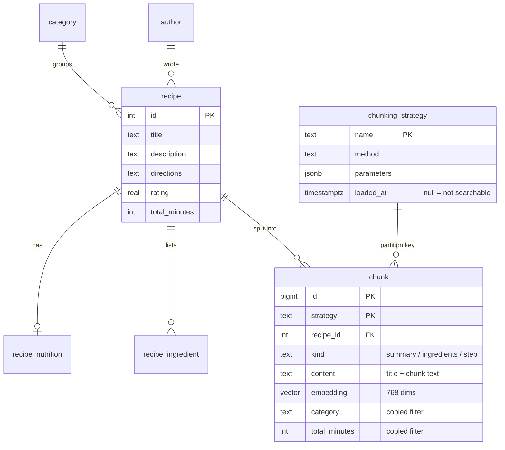
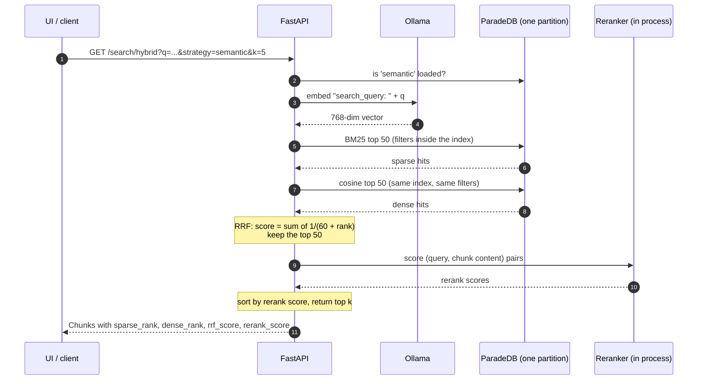
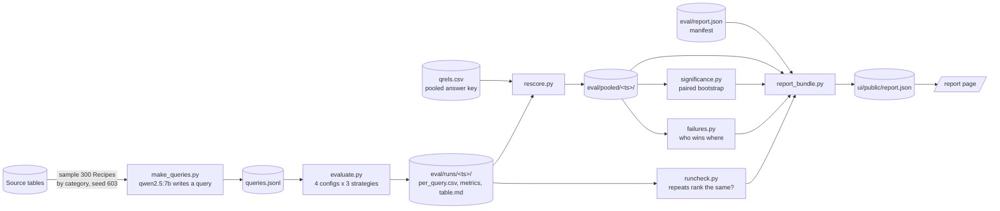

# Architecture

Terms (Recipe, Chunk, Chunking strategy, Fusion baseline) are defined in [CONTEXT.md](../CONTEXT.md). Decisions are in [adr/](adr/).

The repo has four parts that share one database:

1. **Build**: load the dataset and turn Recipes into Chunks (offline, run once per strategy)
2. **Serve**: the FastAPI app answers Sparse, Dense and Hybrid searches
3. **Evaluate**: score the configs on a fixed Query set and save each run to disk
4. **Report**: turn saved runs into one JSON file the Report page reads

## The whole system

Two things to notice:

- `evaluate.py` imports the API's retrieval code rather than calling it over HTTP. What gets scored is exactly what gets served.
- The Report page only needs `report.json`. No database, Ollama or API has to be running to read it.

## Build: from CSV to searchable Chunks

- Summary and Ingredients chunks are identical under every strategy. Only where Step chunks start and end changes.
- Filter columns (category, minutes, rating, calories...) are copied onto each Chunk so the index can filter during the search ([ADR 0001](adr/0001-denormalize-filters-onto-chunk.md)).
- One partition per strategy means each has its own BM25 stats ([ADR 0002](adr/0002-partition-chunk-by-strategy.md)).
- A strategy can't be searched until `loaded_at` is set, so a half-built one never serves results.

## Data model

The source tables are the truth. `chunk` is derived from them and is only rebuilt, never edited.

## Serve: one Hybrid search

- `/search/sparse` stops after step 5 and `/search/dense` after step 7.
- Dense runs on ParadeDB's own vector index, not pgvector HNSW, so one index serves BM25, vectors and filters ([ADR 0003](adr/0003-serve-dense-from-paradedb-index.md)).
- The reranker loads once at startup and runs one batch at a time behind a lock (MPS, CUDA or CPU).
- Settings live in `api/config.py`: 50 candidates per retriever, 50 sent to the reranker, RRF k = 60.

## Evaluate and Report

- Four configs: `sparse`, `dense`, `fusion` (RRF order before reranking, eval only) and `hybrid`.
- Metrics: Recall@5/10/20, MRR, nDCG@5/10 and latency per stage.
- Retrieval is deterministic, so a new answer key only needs `rescore.py`, not new searches ([ADR 0004](adr/0004-score-against-a-pooled-answer-key.md)).
- Timing repeats and Ablation runs (e.g. HNSW, `sql/ablation/`) must rank every query the same as the Report run. `runcheck.py` fails the bundle if they don't.
- The bundle stores a hash of every input. A test fails when the committed `report.json` is older than what it was built from.

## Where things live

| Path | What |
|---|---|
| `api/` | FastAPI app: `retrieval.py` (sparse, dense, RRF, rerank), `filters.py`, `strategies.py`, `embed.py`, `rerank.py` |
| `scripts/` | Build (`ingest.py`), queries, evaluation and report tooling |
| `sql/` | `schema.sql`, `indexes.sql`, migrations, HNSW ablation |
| `eval/` | Query set, answer key, manifest, saved runs |
| `ui/` | React 19 + Vite + Tailwind: search page and Report page |
| `docs/adr/` | Design decisions |
| `tests/` | pytest, including the stale-bundle check |
